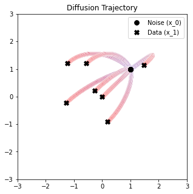
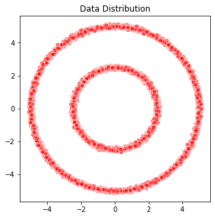

# Flow Matching (toy example)

Simple implementation of [Flow Matching for Generative Modeling](https://arxiv.org/abs/2210.02747) in PyTorch. See `flow_matching.ipynb`.

## Comparison of ODE trajectory
<table align='center'>
<tr align='center'>
<td> Denoising Diffusion </td>
<td> Optimal Transport </td>
</tr>
<tr>
<td></td>
<td></td>
</table>

## Flow matching training
<table align='center'>
<tr align='center'>
<td> Target Data </td>
<td> Sampled Data </td>
</tr>
<tr>
<td></td>
<td></td>
</table>